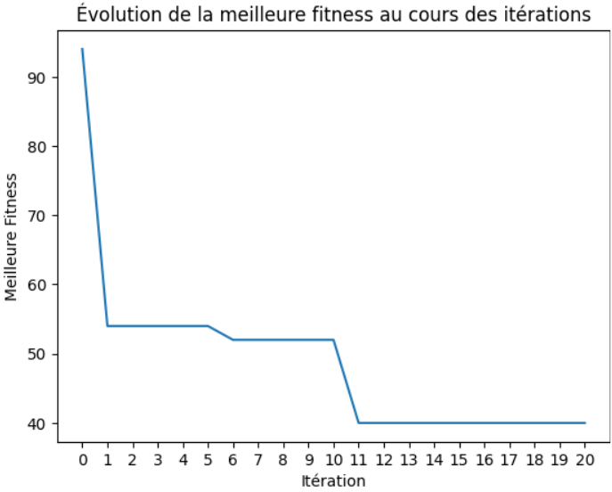

# 🚁 Drone Delivery Path Optimization using Genetic Algorithms

An optimization project that uses a Genetic Algorithm to find the shortest path (a Hamiltonian cycle) for a delivery drone that must visit multiple cities. This project simulates the classic **Travelling Salesman Problem (TSP)**.
  

## 📋 Project Overview

The goal is to plan a tour for a delivery drone to visit a set of cities once and only once, returning to its starting point, while minimizing the total distance traveled. The solution uses evolutionary artificial intelligence techniques to solve this NP-hard problem.

## 🎯 Features

- Randomly generated population initialization.
- Evaluation (Fitness) function based on a distance matrix.
- Roulette wheel selection to choose parents for reproduction.
- Single-point crossover operator with a correction mechanism to ensure chromosome validity.
- Swap mutation operator to introduce genetic diversity.
- Elitist replacement strategy to preserve the best individuals in each generation.
- Visualization of the algorithm's convergence through a fitness evolution curve.

## 🛠️ Tech Stack

- **Programming Language:** Python
- **Libraries:**
  - random (For randomness)
  - matplotlib (For visualization)

## 🚀 Data Model & Input

The problem is defined by a **6x6 distance matrix** between cities. The start and end city is fixed as **City 1**.

Distance Matrix Used:
```
   distance_matrix = [
    [0, 4, 18, 20, 14, 6],  # Distances from City 1
    [4, 0, 12, 8, 10, 16],  # Distances from City 2
    [18, 12, 0, 6, 4, 14],  # Distances from City 3
    [20, 8, 6, 0, 16, 10],  # Distances from City 4
    [14, 10, 4, 16, 0, 12], # Distances from City 5
    [6, 16, 14, 10, 12, 0]  # Distances from City 6
]
   ```
## ⚙️ Genetic Algorithm Methodology

1. Initialization: Generation of an initial population of possible paths (chromosomes).
2. Evaluation: Calculation of the total distance (fitness) for each chromosome.
3. Selection: Selection of parents for reproduction using the roulette wheel method.
4. Crossover: Combination of genes from two parents to create two children.
5. Mutation: swap modification applied to a child to maintain diversity.
6. Replacement: Formation of a new generation by keeping the best individuals (elitism).
7. Termination: The algorithm stops after a maximum number of iterations and returns the best solution found.

## 📈 Results and Performance

The algorithm was executed with the parameters:
POPULATION_SIZE=10, CROSSING_RATE=0.6, MUTATION_RATE=0.01, and NB_MAX_ITERATIONS=20.

**Convergence to an Optimal Path**
The genetic algorithm demonstrated highly effective performance, successfully optimizing the drone's delivery route. The evolution of the best fitness (total distance) across generations shows a clear and significant convergence toward an optimal solution.

  

**Key Result:**
* The algorithm successfully reduced the total travel distance from an initial ~90 km to a final optimal distance of ~40 km.
* The fitness curve shows a rapid decrease in early generations, followed by stabilization, indicating the discovery of a highly efficient, shortest-path route.
* This successful minimization of distance confirms the algorithm's capability to solve the path optimization problem for the given constraints.

**Final Output:**
```
   Optimal Path (Chromosome) : [1, 3, 5, 4, 2, 6]
Total Distance Achieved: 40 km
   ```

## 📁 Repository Structure

```
Drone-Delivery-Optimization-using-Genetic-Algorithm/
│
├── Drone_Delivery_Genetic_Algorithm.ipynb  # Main Jupyter Notebook
├── images/
|   ├──project_pic.png
│   └── fitness_evolution.png                      # Fitness convergence graph
├── README.md                                      # This file

```

## 👩‍💻 Author

**Eya Zaoui**
- 💼 AI & Software Engineer | Passionate about Machine Learning, Expert Systems, and Optimization Algorithms
- 📧 Email: zaouieya2@gmail.com
- 🔗 LinkedIn: [linkedin.com/in/eya-zaoui](linkedin.com/in/eya-zaoui)
